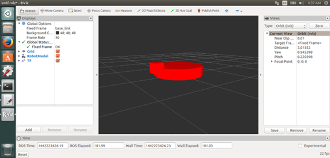

# ros_course
# Part 2: URDF, TF, etc

So far, we have learnt how to use ROS for building and running systems of interconnected software _nodes_ that exchange information using _topics_.  In Part 2, we will build on this to show ROS' robot visualization techniques (URDF - the universal robot description format) and its geometric transformation utilities (TF - transform).

## Modeling the turtle in URDF

Create a `urdf` subfolder in your `ros_course` folder.  In it, make the following file and call it something like `turtle.xml` with these contents:
```xml
<?xml version="1.0"?>
<robot name="turtle">

  <link name="turtle1/base_link">
    <visual>
      <geometry>
        <cylinder length="0.2" radius="0.5"/>
      </geometry>
      <origin rpy="0 0 0" xyz="0 0 0.11"/>
    </visual>
  </link>

  <link name="turtle1/head">
    <visual>
      <geometry>
        <box size="0.2 0.2 0.2"/>
      </geometry>
      <origin rpy="0 0 0" xyz="0.5 0 0.2"/>
    </visual>
  </link>

  <joint name="turtle1/head_to_body" type="fixed">
    <parent link="turtle1/base_link"/>
    <child link="turtle1/head"/>
    <origin xyz="0 0 0"/>
  </joint>

</robot>
```
This is [URDF](http://wiki.ros.org/urdf), an XML schema for describing robots that is supported by lots of ROS tools.  This describes our model as two _links_ (solid shapes) connected by a single fixed _joint_.

> URDF can handle much more complicated models including CAD descriptions of links and various types of moving joints.  We're only just dipping in.

The URDF tutorial package in ROS comes with a helpful viewing utility for developing URDF models, which we shall use to inspect the model we have built.  Run the following from the URDF folder:
```
roslaunch urdf_tutorial display.launch model:=turtle.xml 
```
All being well you should see a turtle picture.  The viewer program is RVIZ, which we will see much more of.



## Animating the turtle

It would be good to connect our turtle model to the simulation, with the goal of seeing multiple turtles move together and interact.  We'll do this using [TF](http://wiki.ros.org/tf), a ROS convention that enables common handling of _transforms_ between reference frames.  Any node can publish a transform message to the common topic `/tf` reporting where one named frame is relative to another.  Then a standard software client can subscribe to `/tf` and calculate the relation between any two known frames.  We'll use it to figure out where one turtle is relative to another.

> This illustrates a different way of using a topic, as a broadcast channel rather than point-to-point.

Some simulators and robots support TF themselves, but we need an extra node to report the turtle position as a transform using TF.  Make the following in your scripts folder:
```python
#!/usr/bin/env python  
import roslib
roslib.load_manifest('ros_course')
import rospy
import tf
import turtlesim.msg

class TurtleTfPublisher:

    def __init__(self):
        rospy.init_node('turtle_tf_broadcaster', anonymous=True)
        self.turtle_name = rospy.resolve_name('turtle1')
        self.tf_broadcaster = tf.TransformBroadcaster()
    
    def pose_callback(self, msg):
        self.tf_broadcaster.sendTransform((msg.x, msg.y, 0),
                                          tf.transformations.quaternion_from_euler(0, 0, msg.theta),
                                          rospy.Time.now(),
                                          self.turtle_name+'/base_link',
                                          "world")

    def run(self):
        rospy.Subscriber('turtle1/pose',
                         turtlesim.msg.Pose,
                         self.pose_callback)
        rospy.spin()

if __name__ == '__main__':
    tp = TurtleTfPublisher()
    tp.run()
```
Note that TF is so common, they've wrapped the publishing in a little client helper for us.  This would work with the same `publish` method we used earlier too.

> Quaternions?  These are an elegant way of [representing a rotational transformation](https://en.wikipedia.org/wiki/Quaternions_and_spatial_rotation).  You might think of a transform as three angles, _e.g._ roll, pitch and yaw, but there are ambiguous definitions of those angles and they exhibit singularities in some orientations.  The full 3x3 transformation matrix is unambiguous but needs nine numbers to encode.  A quaternion is only four numbers but avoids the singularity and ambiguity issues.  Details are beyond our scope here, but if you get into anything geometric, learn to love them.  [Never work with angles!](https://tomekent.com/post/neuron_saturation/)

Finally we will need a launch file to start everything:
```xml
<launch>
    <param name="robot_description" command="cat $(find ros_course)/urdf/turtle.xml" />
    <node name="turtlesim" pkg="turtlesim" type="turtlesim_node" />
    <node name="driver" pkg="ros_course" type="drive.py" />
    <node name="tfpub" pkg="ros_course" type="turtle_tf_pub.py" />
    <node name="rviz" pkg="rviz" type="rviz" />
    <node name="robot_state_publisher" pkg="robot_state_publisher" type="robot_state_publisher"/>
</launch>
```
It's worth talking this through:
```xml
<param name="robot_description" command="cat $(find ros_course)/urdf/turtle.xml" />
```
The line above reads our URDF model into a parameter named `robot_description`.  RViz and several other ROS tools look here by default for the URDF of the robot.
```xml
<node name="turtlesim" pkg="turtlesim" type="turtlesim_node" />
<node name="driver" pkg="ros_course" type="drive.py" />
```
The two lines above start the turtle simulator and our rdiver node from part 1, that just made it wander randomly.
```xml
<node name="tfpub" pkg="ros_course" type="turtle_tf_pub.py" />
```
Above starts the new node that publishes the turtle pose to `/tf`.
```xml
<node name="rviz" pkg="rviz" type="rviz" />
```
Above launches the `RViz` viewer tool.
```xml
<node name="robot_state_publisher" pkg="robot_state_publisher" type="robot_state_publisher"/>
```
Finally the line above starts a `robot_state_publisher` node which is a standard tool in ROS.  It reads the URDF from the `robot_description` model and calculates the transforms between the different links, publishing them to TF.  THis is the link between URDF and TF.  If our robot model including moving joints, it would read their values in and determine the forward kinematics for us. 

Run the launch file and you should see a simple turtle model ambling round the RViz screen.  Also look closely at the TF arrows and poke around RViz a bit - it's very useful.

> Can't see it?  In the `Displays` pane click `Add` and include the `TF` display and the `RobotModel` display.

## Two turtles together

> At this point we're going to have to say goodbye to the URDF.  An update to the `robot_state_publisher` in ROS Noetic removed a really useful feature for multi-robot work and made it much harder to have two URDF robot models in the same system.  The issue has actually [been fixed](https://github.com/ros/robot_state_publisher/pull/169) in the source code, and there are workarounds, but all beyond the scope of this tutorial.

Run this launch file:
```xml
<launch>
  
  <node name="rviz" pkg="rviz" type="rviz" />

  <group ns="bob">
    <node name="turtlesim" pkg="turtlesim" type="turtlesim_node" />  
    <node name="tfpub" pkg="ros_course" type="turtle_tf_pub.py" />
    <node name="drive" pkg="ros_course" type="drive.py" />
  </group>

  <group ns="margaret">
    <node name="turtlesim" pkg="turtlesim" type="turtlesim_node" />
    <node name="tfpub" pkg="ros_course" type="turtle_tf_pub.py" />
    <node name="drive" pkg="ros_course" type="drive.py" />
  </group>

</launch>
```
This is going to run two turtles with attached TF publishers and random drivers.  You won't see the URDF models any more, but with the `TF` viewer turned on in RViz, you should see two little arrows and reference frame axes representing the movements of the two turtles.

### Inter-turtle relations

Add the following Python script to your `ros_course` package.
```python
#!/usr/bin/env python  
import roslib
roslib.load_manifest('ros_course')
import rospy
from math import atan2
import tf
import geometry_msgs.msg

rospy.init_node('tf_turtle')

listener = tf.TransformListener()

rate = rospy.Rate(1.0)

while not rospy.is_shutdown():
    try:
        (trans,rot) = listener.lookupTransform('/bob/turtle1/base_link', '/margaret/turtle1/base_link', rospy.Time(0))
    except (tf.LookupException, tf.ConnectivityException, tf.ExtrapolationException):
        continue

    print("Margaret relative to Bob")
    print(trans)

    rate.sleep()
```

Here is the magic of TF.  The built-in `TransformListener` object will subscribe to the `/tf` topic and keep track of all the messages it receives.  Then we can query it for the relative transform between two reference frames -- even though the connections between those frames and their intermediates came from different source nodes.  One publisher told us how Bob relates to World, another node told how Margaret relates to World, and TF fills in all the transforms and inverse transforms to join the two.

Run this alongside the two turtle simulation above and you should see messages showing the position of Margaret relative to Bob, _i.e._ where is Margaret in the ference frame attached to Bob.  See if you can verify it with what you see on the screen.

## Exercise: make Bob follow Margaret

Write a node and associated launch file to make one turtle point towards the other, or even follow the other one around.  Re-use existing components as much as possible.
