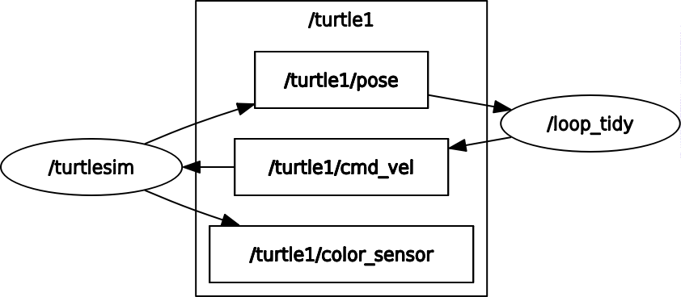
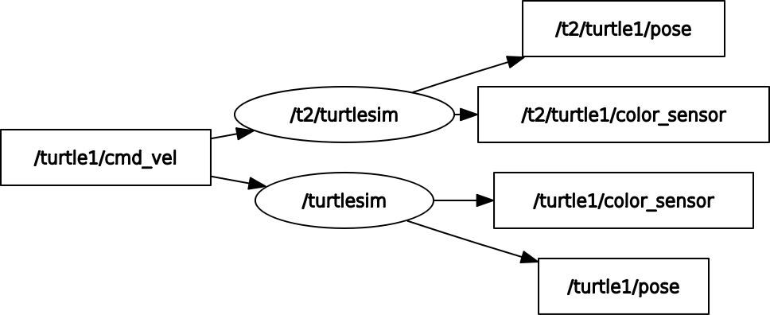

# ros_course
Short ROS training course at the Bristol Robotics Lab, developed by the FARSCOPE Centre for Doctoral Training

## Background


ROS (in our context) stands for the [Robot Operating System](https://ros.org/).  It's not really an operating system as it runs on top of Ubuntu Linux, but it provides a blackboard-type message passing and standards for robots.  ROS is great for being supported by lots of off-the-shelf robots, making it easy to share and build on existing software, and taking care of repetitive housekeeping stuff like logging.  However, the learning curve is quite steep, it's quite limited to Ubuntu, the timing model is challenging, and it's hard to keep up with regular upgrades.

> ROS2 has been released that improves things like networking, security, and the timing model.  It also offers Windows support.  However, it is sometimes even more complicated.  We've chosen to stay with ROS "1" for now.

This version of tutorial is written and tested for ROS Noetic (having evolved over years from previous versions).  All coding will be done in Python, although C++ is also supported.

Key ROS concepts are *nodes* (programmes that talk using ROS) and *topics* (channels over which messages are exchanged).  A ROS _node_ works by publishing and/or subscribing to different ROS _topics_.

> ROS topics are asynchronous, like emails.  You send one, and you may or may not get an answer.  ROS also supports *services* which are like phone calls.  A services is called and gives a response.  Services are gest avoided for various reasons, not least because they block the caller.  There are also *actions* which are special arrangements of _topics_ offering call, response, progress reports, cancellation or completion.  They're much more flexible and robust, but complicated, beyond the scope.

## Set up your Workspace

Having [installed ROS](http://wiki.ros.org/ROS/Tutorials/InstallingandConfiguringROSEnvironment), open up a terminal and type the following to create the workspace
```
mkdir -p ~/catkin_ws/src
cd ~/catkin_ws/src
catkin_init_workspace
```
If that fails, try `source /opt/ros/noetic/setup.bash` and then try again.

Packages in your workspace are compiled using the following, test this now.
```
cd ~/catkin_ws/
catkin_make
```
To let ROS know where the workspace is you should update your .bashrc with the following command.  This will save you a lot of typing over the course of this tutorial.
```
echo source ~/catkin_ws/devel/setup.bash >> ~/.bashrc
```
The double chevrons after an echo allow you to append to a file, we can check how this has changed the .bashrc by typing
```
less ~/.bashrc
```
Press Q to exit the file preview. Now reopen the terminal or type
```
source ~/.bashrc
```
We can check that this all worked by looking at the ROS package path with
```
echo $ROS_PACKAGE_PATH
```
which should provide the following output
```
/home/USERNAME/catkin_ws/src:/opt/ros/noetic/share
```

## Drive a Turtle

Start a ROS core (the hub of all ROS communications – you’ll get “cannot communicate with master” errors if you try and do anything ROS-based without a core running)
```
roscore
```
Now in a new terminal or tab (press Ctrl+Shift+T), run the turtle simulator:
```
rosrun turtlesim turtlesim_node
```
Use `rostopic list` to explore what topics have been created.  `rostopic echo <topic>` will show what's being published to them.

Now manually send a command to the turtle
```
rostopic pub /turtle1/cmd_vel geometry_msgs/Twist '{linear:  {x: 1.2, y: 0.0, z: 0.0}, angular: {x: 0.0,y: 0.0,z: 0.2}}'
```
And then use RQT for the same job, using either the message publisher plug-in or the robot steering plug-in.
```
rqt
```

## Creating a ROS Package
Create a package called “ros_course” for use with all the exercises
```
cd ~/catkin_ws/src
catkin_create_pkg ros_course std_msgs rospy turtlesim
cd ..
catkin_make
```
This creates a package called ros_course, which depends on the packages std_msgs, rospy and turtlesim
Check ROS has found your new package by looking for it in the package list:
```
rospack list
```

## A Publisher Node
Put the following in a file `drive.py` in the `scripts` directory of your new ROS package. 
```python
#!/usr/bin/python
import rospy
from geometry_msgs.msg import Twist
import random

# set up a publisher
pub = rospy.Publisher('turtle1/cmd_vel', Twist, queue_size=1)
# start the node
rospy.init_node('driver')
# will be updating at 2 Hz
r = rospy.Rate(2)
# constant speed for now
turtle_speed = 2.0

while not rospy.is_shutdown():
   # make a blank velocity message
   msg = Twist()
   # pick a random direction
   msg.angular.z = 2*(random.random() - 0.5)
   # constant speed
   msg.linear.x = turtle_speed
   # publish it
   pub.publish(msg)
   # show a message
   rospy.loginfo("New turn rate=%s"%msg.angular.z)
   # wait for next time
   r.sleep()
```
*Make it executable*
```
chmod +x drive.py
```
Make sure your `roscore` and turtle simulator are still running, and now type
```
rosrun ros_course drive.py
```
You should see your turtle wander aimlessly round its world, probably up against the wall before long.

> You would have got away with just executing the file, but the `rosrun` is the _right_ way and we'll need it later.

## Configure your node with a parameter

ROS supports a parameter server for sharing configuration information between nodes.  Let's use it to set the turtle speed.  Edit the `turtle_speed = ` line as shown below.

```
# get speed from parameter
turtle_speed = rospy.get_param('turtle1/turtle_speed',1.0)
```

Re-run the node and the turtle should move with the default speed of 1.0.  Now stop the node and run the following
```
rosparam set /turtle1/turtle_speed 0.2
```
Run the node again and you should have a very slow turtle.

> Parameters are slower than topics and support different access mechanisms.  Use them only for configuration, reading and setting parameters when a node starts.  They should not be used for live communication between nodes.

## A subscriber node

Make the file below in your `scripts` directory and `chmod +x` it to make it executable.  With roscore, the turtle and your turtle driver still running, run this file too.
```python
#!/usr/bin/python
import rospy
from geometry_msgs.msg import Twist
from turtlesim.msg import Pose
from math import sqrt

# start the node
rospy.init_node('listen')    

# callback for pose does all the work
def pose_callback(data):
  rospy.loginfo("x is now %f" % data.x)

# and the subscriber
rospy.Subscriber("turtle1/pose",Pose,pose_callback)
rospy.spin()
```
You should see loads of messages telling you the X position of the turtle.

> Try using RQT to see the same topic and investigate what else is in the message.

## Close a loop

Time to close a feedback loop, requiring a node that can both publish and subscribe.  Remember that remark about the ROS timing model?  This is where it needs a little thought.  The subscriber runs in its own thread, with the callback function triggered by an incoming message.  We _could_:
1. Put the publishing in the callback function, but that means we don't have control over the update rate.  It also means _everything_ from measurement to response has to be in the callback, which can be a problem if it overruns and the next one comes in before we've finished the first one.
2. Have the callback write the measurement into a global variable that gets picked up by the main thread at a controlled, constant rate.  This is much better for timing, but global variables are generally frowned upon for creating wormholes in code.
3. _The winner_: write the controller as a class and use a class property to communicate between the threads.  This encapsulates the wormhole and is much easier to maintain.

Make the following file in your scripts directory.
```python
#!/usr/bin/python
import rospy
from geometry_msgs.msg import Twist
from turtlesim.msg import Pose
from math import sqrt

class TurtleControlNode:

  def __init__(self):
    self.radius = 4.0
    # start the node
    rospy.init_node('loop_tidy')    
    # set up a publisher
    self.pub = rospy.Publisher('turtle1/cmd_vel', Twist, queue_size=3)
    # rate and control
    self.rate = rospy.Rate(10)
    self.msg = Twist()

  def poseCallback(self,data):
    self.radius = sqrt((data.x-5.0)**2 + (data.y-5.0)**2)
    rospy.loginfo("radius is now %f" % self.radius)

  def run(self):
    # start the subscriber
    rospy.Subscriber("turtle1/pose",Pose,self.poseCallback)
    # main control loop
    while not rospy.is_shutdown():
      turn_rate = 0.3*(self.radius - 4.0)
      self.msg.linear.x = 0.5
      self.msg.angular.z = turn_rate
      self.pub.publish(self.msg)
      self.rate.sleep()

if __name__=='__main__':
  t = TurtleControlNode()
  t.run()
```
To run it, kill off any existing turtle drivers or listeners, but keep the `roscore` and the `turtlesim_nod` running.  Now run the control node.  It's supposed to stabilize your turtle on a circle of radius 4.  It probably won't, as we've not designed the controller very well, but you should see something happening.

Tyoe `rqt-graph` to inspect the nodes and topics in use.  Play with the settings to see what's available.  You should see sonething like the image below.



## Exercise: Bouncing Turtle

Modify your turtle controller so the turtle changes direction when it hits a wall.  It's not as easy as it sounds.

## Namespaces and re-mapping

When accessing files in code, you're probably familiar with the idea of a relative path, interpreted with respect to the current working directory.  ROS does something similar with topics, which can be relative to the current working _namespace_.  ROS also enables specific re-mapping of names, such that inputs or outputs of a node can be re-routed to different topics without changing the source code.  Now we'll use these ideas to re-use our existing code to drive two different turtles.

Get your first turtle simulator up and running and then start a second using the following.
```
ROS_NAMESPACE=/t2 rosrun turtlesim turtlesim_node
```
Use `rostopic list` and `rqt` to investigate what's going on and make sure you can drive both turtles.

Can you get two copies of your turtle controller going to control each turtle separately?

### Re-map

Run the following, re-using `drive.py` from the exercise making your first publisher node.
```
rosrun ros_course drive.py turtle1/cmd_vel:=t2/turtle1/cmd_vel
```
You should see the second turtle move, instead of the first.  Compare the effect with and without the `/turtle1/cmd_vel:=` bit on the end.  This is a _re-map_ command: when `drive.py` publishes to `turtle1/cmd_vel` the re-map re-routes the topic to `t2/turtle1/cmd_vel`.

Now kill the second turtle simulator and try this:
```
ROS_NAMESPACE=/t2 rosrun turtlesim turtlesim_node /t2/turtle1/cmd_vel:=/turtle1/cmd_vel
```
Try driving the first turtle and you should see the second one go as well.  Use `rqt-graph` to verify what's going on.  You should see that the re-map has connected the second turtle's input to the same topic as the first turtle.



### Namespace

Get back to having two turtles running again, independently.  From scratch:
```
rosrun turtlesim turtlesim_node
ROS_NAMESPACE=/t2 rosrun turtlesim turtlesim_node
```
Now run your feedback controller node using:
```
rosrun ros_course <your turtle control node>
```
You should see the first turtle do its wobbling around in circles but the second turtle stay still.  Now start a second controller using:
```
ROS_NAMESPACE=/t2 rosrun ros_course <your turtle control node>
```

### Summary

Re-maps are great for re-use or re-plumbing.  If you have downloaded a package for some job, but your robot uses different names for the sensor or control channels, re-map is the answer.  Or, you might want to break an existing connection and put something extra in the loop -- again, re-mapping will solve the problem.

Namespaces are great for repetition.  Suppose you want to have three robots, or your robot has two arms, left and right.  Namespaces for each will enable slick re-use of the same functionality without code changes.

Overall, these features greatly add to ROS' modularity: the ability to make a node that does a job, and then leave it untouched while you use it in different ways.

## Launch files

By now, you ought to be fed up launching terminals and keeping track of them.  Stop everything you have running, including your `roscore`, and have just one terminal.  We'll use launch files to run all the examples above with just one command.

Make a file called `turtle.launch` in a `launch` directory below `src` in your package, containing the following:
```xml
<launch>
   <node name="turtle1" pkg="turtlesim" type="turtlesim_node" />
   <node name="control1" pkg="ros_course" type="drive.py" />
</launch>
```
Now run it using
```
roslaunch ros_course turtle.launch
```
Three things happen at once: a `roscore` is launched for you, so is a simulator, and so is your driver code.  You should see a turtle wandering aimlessly.  Stop everything with a single `<Ctrl>+C`.

Copy your file to `turtle2.launch` and edit to the following:
```xml
<launch>
   <param name="turtle1/turtle_speed" value="0.3" />
   <node name="turtle1" pkg="turtlesim" type="turtlesim_node" />
   <node name="control1" pkg="ros_course" type="drive.py" />
</launch>
```
Run this one and you should see a slow turtle, as a result of setting the speed parameter.

Now try this file, which reproduces the example where two turtles are driven by the same driver using a re-map:
